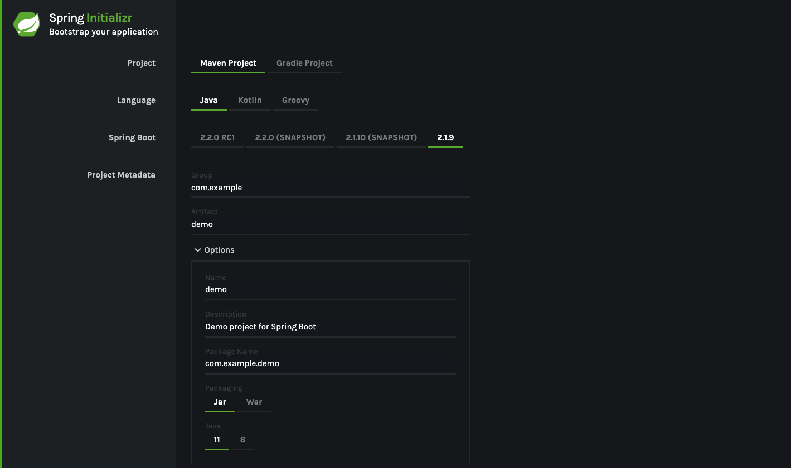
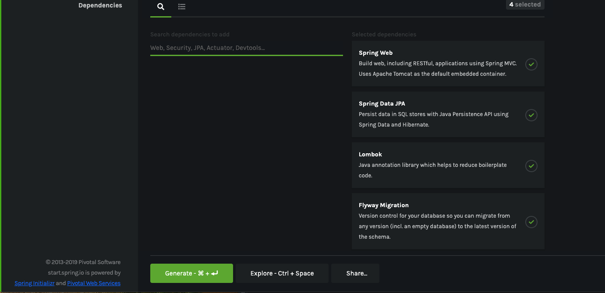
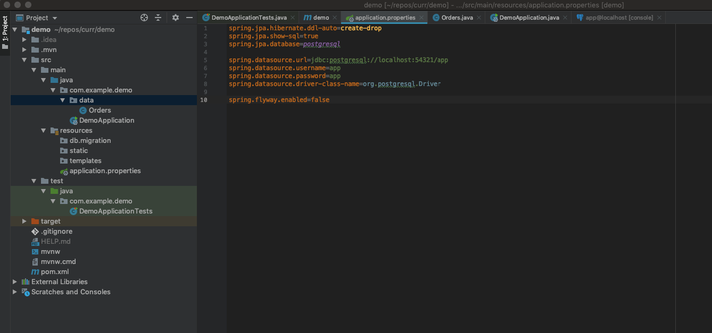
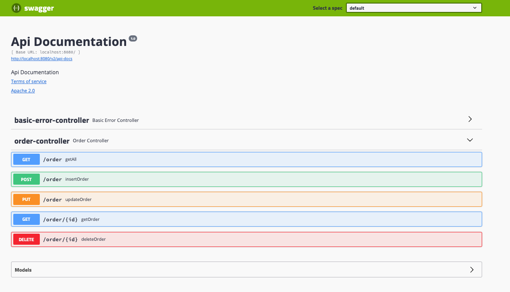

# Title


## Setup

Go to https://start.spring.io/

and select such options



for dependencies select



and press generate.

Import new project in IntelliJ.

Setup lombok in IntelliJ
https://projectlombok.org/setup/intellij
remember to enable annotation processing (ctrl+shift+a and search for annotation processing)

Create new instance of postgres db

`docker run -p 54321:5432 -e POSTGRES_USER=app postgres`


## DB Connection

Inside project in resources you should have
application.properties file

setup properties for db connection like that

    spring.flyway.enabled=false

    spring.jpa.hibernate.ddl-auto=create-drop
    spring.jpa.show-sql=true
    spring.jpa.database=postgresql

    spring.datasource.url=jdbc:postgresql://localhost:54321/app
    spring.datasource.username=app
    spring.datasource.password=app
    spring.datasource.driver-class-name=org.postgresql.Driver



## Entity class

JPA/Hibernate and Spring data are using annotations to tell which objects are db entities

lets add a Orders table.
Create new package `data` and add there Orders.class

```
@Entity
@Data
@Accessors(chain = true)
public class Orders {

  @GeneratedValue(strategy = GenerationType.IDENTITY)
  @Id
  private Long id;
  private String number;
  private String client;
  private BigDecimal price;
  private String status = "not verified";

}
```

run program and check if Orders table was created.

## Repositories

Lets add now a repository.
Create a new package `repository` and create there a OrderRepository interface.

```
public interface OrderRepository extends CrudRepository<Orders, Long> {}
```

it should inherit CrudRepository where first we put our entity object and as second param we use id type.

## Using repository

How to use repository ?

Modify DemoApplication file to look like this
```

@SpringBootApplication
@Slf4j
public class DemoApplication implements ApplicationRunner {

	final OrderRepository orderRepository;

	public DemoApplication(OrderRepository orderRepository) {
		this.orderRepository = orderRepository;
	}

	public static void main(String[] args) {
		SpringApplication.run(DemoApplication.class, args);
	}

	@Override
	public void run(ApplicationArguments args) throws Exception {
		String client = "Client";
		orderRepository.save(new Orders().setClient(client).setNumber("Number").setPrice(BigDecimal.valueOf(100L)));
		orderRepository.save(new Orders().setClient(client).setNumber("Number1").setPrice(BigDecimal.valueOf(100L)));
	}
}

```

this code:

```
    final OrderRepository orderRepository;

    public DemoApplication(OrderRepository orderRepository) {
		this.orderRepository = orderRepository;
    }
```

is our dependency injection is something that spring is doing for us.
Spring create OrderRepository object and inject it in our DemoApplication class so we can use it here.

this method 
`@Override public void run(ApplicationArguments args) throws Exception `
is an ApplicationRunner method it is running when application starts.

Inside we are using our `orderRepository`.
In orderRepository we don't have any methods but CrudRepository have some you can check that and we are using one of them `.save()` this method updates or insert new object into db. 

Run program and check if Orders table is not empty.

## Exercise 1

Add new entity object Products and repository for it.
it should have id, name, category, description, price fields.

Then using application runner add few products to db.

## Custom queries

We can add some repository methods by ourself.
Some of them will be handled by spring and in some we have to specify our queries.

```
public interface OrderRepository extends CrudRepository<Orders, Long> {

  Optional<Orders> findByClientAndAndNumber(String client, String number);

  @Query("select o from Orders o")
  List<Orders> findAllCustom();
}
```

this one `Optional<Orders> findByClientAndAndNumber(String client, String number);`
is handled by spring you can notice that during writing it you can use autocomplete.
Method should have same names that fields in our entity objects.

another one 

```
@Query("select o from Orders o")
  List<Orders> findAllCustom();
```

we have to write our own query, this query is not plain sql it is JPQL

https://www.tutorialspoint.com/jpa/jpa_jpql.htm

https://www.baeldung.com/spring-data-jpa-query

## Exercise 2

Write one spring query for products table
and one custom query.

Find products by category and price.
Find all products where price is higher than xxx.

Use them in application runner to test them.

# REST vs HTTP

REST is a way how HTTP should be used.

???

## API

How to create api endpoints.

Create controller package and add there OrdersController.class

```
@RestController
@RequestMapping("/order")
public class OrderController {

  private final OrderRepository orderRepository;

  public OrderController(OrderRepository orderRepository) {
    this.orderRepository = orderRepository;
  }

  @RequestMapping(method = RequestMethod.GET)
  public Iterable<Orders> getAll(){
    return orderRepository.findAll();
  }

  @RequestMapping(path = "/{id}",method = RequestMethod.GET)
  public Orders getOrder(@PathVariable("id") Long id) {
    return orderRepository.findById(id).orElseThrow();
  }

  @RequestMapping(method = RequestMethod.POST)
  @ResponseStatus(HttpStatus.CREATED)
  public Orders insertOrder(@RequestBody Orders orders) {
    return orderRepository.save(orders);
  }

  @RequestMapping(method = RequestMethod.PUT)
  public Orders updateOrder(@RequestBody Orders orders) {
    return orderRepository.save(orders);
  }

  @RequestMapping(path = "/{id}",method = RequestMethod.DELETE)
  @ResponseStatus(HttpStatus.NO_CONTENT)
  public void deleteOrder(@PathVariable("id") Long id) {
    orderRepository.deleteById(id);
  }

}
```
`@RestController` - tell spring that this is our controller bean/class

`@RequestMapping("/order")` - path to our endpoints

`@RequestMapping(path = "/{id}",method = RequestMethod.GET)` - {id} path param, method is which http method will be mapped to that code

`@ResponseStatus(HttpStatus.NO_CONTENT)` - what response status should be returned

## Swagger

To enable swagger we have to add those two dependencies

```
<dependency>
    <groupId>io.springfox</groupId>
    <artifactId>springfox-swagger2</artifactId>
    <version>2.9.2</version>
</dependency>
<dependency>
    <groupId>io.springfox</groupId>
    <artifactId>springfox-swagger-ui</artifactId>
    <version>2.9.2</version>
</dependency>
```

and add a configuration class for spring

```
@Configuration
@EnableSwagger2
public class SwaggerConfig {                                    
    @Bean
    public Docket api() { 
        return new Docket(DocumentationType.SWAGGER_2)  
          .select()                                  
          .apis(RequestHandlerSelectors.any())              
          .paths(PathSelectors.any())                          
          .build();                                           
    }
}
```

run app and open
http://localhost:8080/swagger-ui.html

you should have view similar to this:


## Exercise 3

Create same CRUD api for Product and check if swagger is updated.

## RestAssured + AssertJ

Add rest assured and assertJ dependencies
```
    <dependency>
            <groupId>io.rest-assured</groupId>
            <artifactId>rest-assured-all</artifactId>
            <version>4.1.1</version>
            <scope>test</scope>
    </dependency>

		<dependency>
            <groupId>io.rest-assured</groupId>
            <artifactId>rest-assured</artifactId>
            <version>4.1.1</version>
            <scope>test</scope>
		</dependency>

    <dependency>
            <groupId>org.assertj</groupId>
            <artifactId>assertj-core</artifactId>
            <version>3.11.1</version>
            <scope>test</scope>
    </dependency>

	  <dependency>
            <groupId>org.junit.jupiter</groupId>
            <artifactId>junit-jupiter</artifactId>
            <version>5.5.2</version>
		</dependency>
```
Lets now write test for getting products

```
@ExtendWith(SpringExtension.class)
@SpringBootTest(webEnvironment = SpringBootTest.WebEnvironment.RANDOM_PORT)
class OrderControllerTest {

  @LocalServerPort
  private int port;

  @Autowired
  OrderRepository orderRepository;

  @Test
  void getAll() {
    Orders order = orderRepository.save(new Orders().setClient("clientTest1").setNumber("Number").setPrice(BigDecimal.valueOf(100L)));

    List<Orders> ordersList = Arrays.asList(given()
            .port(port)
            .basePath("/order")
            .when()
            .get()
            .then()
            .statusCode(200)
            .extract().as(Orders[].class));

    Orders orderFromBody = ordersList.stream().filter(o -> o.getId().equals(order.getId())).findFirst().orElseGet(Orders::new);

    assertThat(orderFromBody).isEqualToIgnoringGivenFields(order,"price");
    assertThat(orderFromBody.getPrice()).isEqualByComparingTo(order.getPrice());
  }

}
```

this is how delete test should look like

```
@Test
  void deleteOne() {
    Orders order = orderRepository.save(new Orders().setClient("clientTest1").setNumber("Number").setPrice(BigDecimal.valueOf(100L)));

    List<Orders> ordersList = Arrays.asList(given()
            .port(port)
            .basePath("/order")
            .when()
            .get()
            .then()
            .statusCode(200)
            .extract().as(Orders[].class));

    assertThat(ordersList.stream().anyMatch(o -> o.getId().equals(order.getId()))).isTrue();

    given().port(port)
            .basePath("/order")
            .when()
            .pathParam("id", order.getId())
            .delete("/{id}")
            .then()
            .statusCode(204);

    assertThat(orderRepository.findById(order.getId())).isEmpty();
  }
```

and here test for inserting

```
@Test
  void insertOne() {
    Orders order = given().port(port)
            .basePath("/order")
            .when()
            .contentType(ContentType.JSON)
            .body(new Orders().setClient("clientTest1").setNumber("Number").setPrice(BigDecimal.valueOf(100L)))
            .post()
            .then()
            .statusCode(201)
            .extract().as(Orders.class);

    Optional<Orders> ordersOptional = orderRepository.findById(order.getId());

    assertThat(ordersOptional).isNotEmpty();
    assertThat(ordersOptional.get()).isEqualToIgnoringGivenFields(order,"price");
    assertThat(ordersOptional.get().getPrice()).isEqualByComparingTo(order.getPrice());
  }
```

Look that everything before get(),post() or any other http method in rest assured returns `RequestSpecification` object
so this is something that can be extracted, some base configuration for endpoint and later reused in some tests.

```
private RequestSpecification spec(){
    return given()
            .port(port)
            .basePath("/order")
            .when();
  }
```

## Exercise 4

Write rest assured tests for orders update and products endpoints

## Async

What types of async communication we can have ??


Lets run our order verification system.
`java -jar wiremock-standalone-2.25.1.jar --port 8282 -v`

check mappings folders and json inside.

We also have to modify our app to send status verification request.

We will use for that purpose rest template.
First we have to create a RestTemplate bean() in our Application class.

```
  @Bean
  public RestTemplate restTemplate() {
    return new RestTemplate();
  }
```

Then we can inject it into our controller class.

```
  @Autowired
  RestTemplate restTemplate;
```

and to make async call we have to do it in separate thread so lets create new thread pool.
```
ExecutorService executor = Executors.newSingleThreadExecutor();
```

then we can modify our api insert method

```
  @RequestMapping(method = RequestMethod.POST)
  @ResponseStatus(HttpStatus.CREATED)
  public Orders insertOrder(@RequestBody Orders orders) {
    Orders persistedOrder = orderRepository.save(orders);

    executor.execute(() -> {
        log.info("Send order for verification: {}", orders);

      try {
        TimeUnit.SECONDS.sleep(new Random().nextInt(10));
      } catch (InterruptedException e) {
        log.error(e.getMessage());
        Thread.currentThread().interrupt();
      }

      ResponseEntity<StatusResponse> status = restTemplate.postForEntity("http://localhost:8282/status",
                new HttpEntity<>(new StatusRequest().setClient(orders.getClient()).setPrice(orders.getPrice())),
                        StatusResponse.class);

        log.info("Order verified with status: {}", Objects.requireNonNull(status.getBody()).getStatus());

        orderRepository.save(persistedOrder.setStatus(status.getBody().getStatus()));
    });

    return persistedOrder;
  }
```

and we have add two inner classes for our status request and body handling

```
  @Data
  @NoArgsConstructor
  @Accessors(chain = true)
  static class StatusRequest {
    private String client;
    private BigDecimal price;
  }

  @Data
  @NoArgsConstructor
  static class StatusResponse {
    private String status;
  }
```

## Exercise 5

Write tests for checking if order was rejected or accepted.

## Awaitility

https://github.com/awaitility/awaitility

```
<dependency>
      <groupId>org.awaitility</groupId>
      <artifactId>awaitility</artifactId>
      <version>4.0.1</version>
      <scope>test</scope>
</dependency>
```

using awaitility with assertJ
https://github.com/awaitility/awaitility/wiki/Usage#using-assertj-or-fest-assert 


## Exercise 6

Apply awaitility to your tests


## API tests as e2e or as integration tests

## Many-to-Many
## N+1
## Wiremock
## Pact.io
## Migrations
